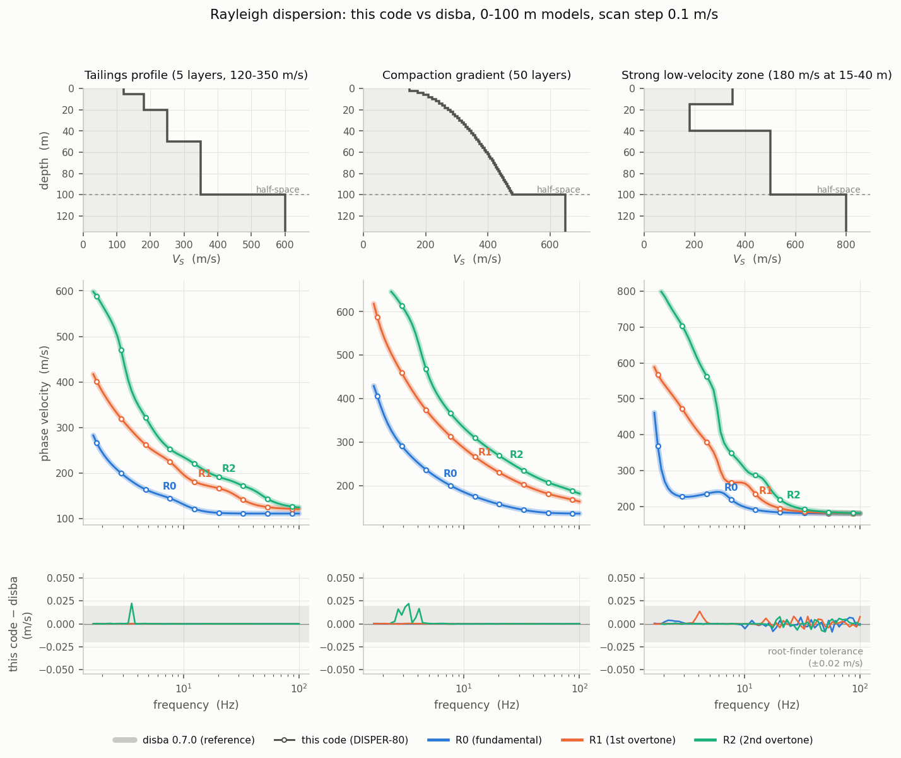
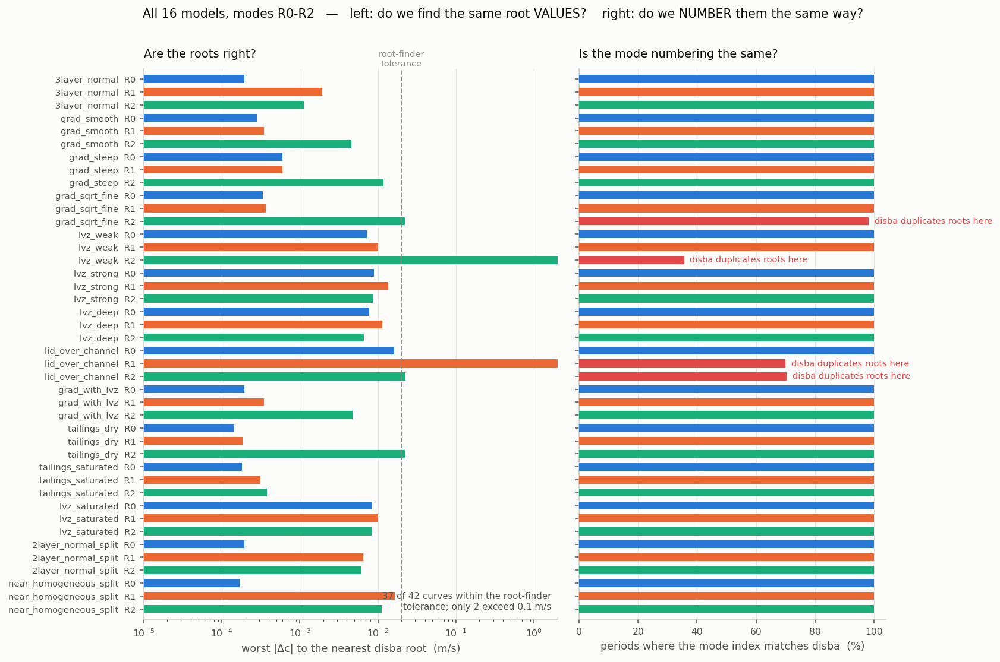
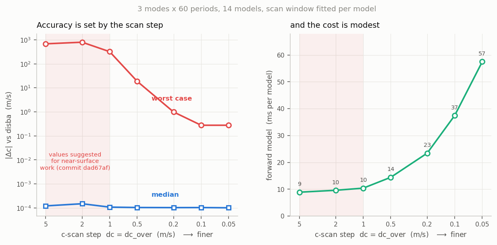
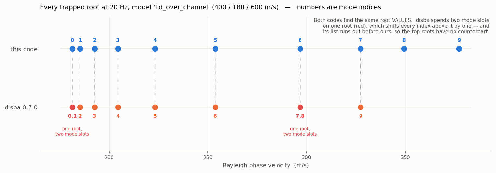
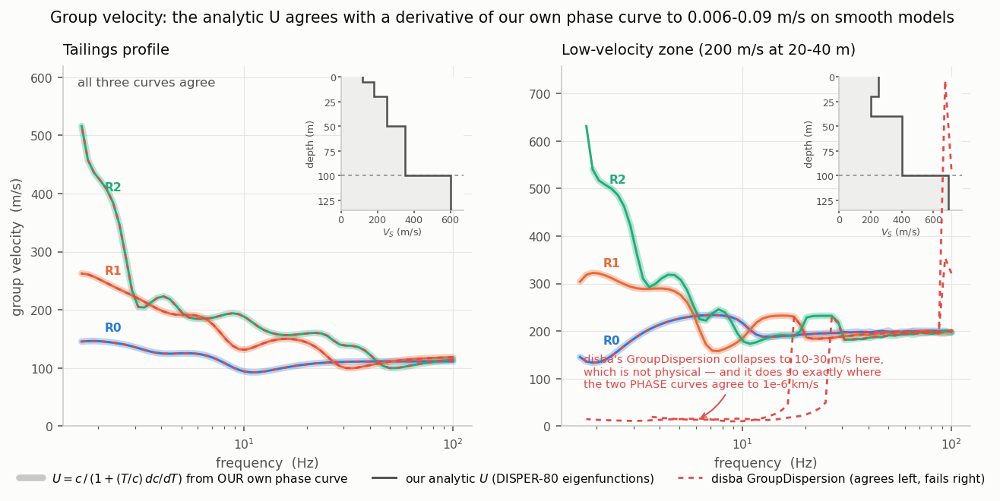

# SWD forward-model validation against disba

Verifies the Rayleigh forward model used by `LOGLHOOD_SWD`
(`dispersion()` -> `RAYDSPN` -> `RAYMRX`, Saito DISPER-80) against
[disba](https://github.com/keurfonluu/disba) 0.7.0 (Dunkin matrix, float64),
for the fundamental mode and the first two overtones, phase and group velocity,
on shallow (0-100 m) models with low-velocity zones and gradients.

## Running

```bash
gfortran -O2 -fallow-argument-mismatch -std=legacy -fdec-format-defaults -w \
    -fno-realloc-lhs -o disp_driver disp_driver.f90 ../src/swd/libswd.a
python compare_disba.py --dc 0.0001 --dc-over 0.0001
```

```bash
python make_figures.py            # -> figures/fig1..fig5 (PNG + PDF)
```

| file | what it does |
|---|---|
| `disp_driver.f90` | calls `dispersion()` exactly as `LOGLHOOD_SWD` does, once with `IGRP=0` and once with `IGRP=1`; emits CSV |
| `make_figures.py` | the five figures below |
| `models.py` | 16 test models: normal dispersion, gradients, LVZs, fast lid over slow channel, dry and saturated tailings |
| `compare_disba.py` | main comparison; summary table + per-period `detail.csv` |
| `diag_lvz.py` | scan-step and scan-origin sweep for the LVZ fundamentals |
| `diag_modes.py` | which disba mode index the Fortran's mode *m* actually matches |
| `diag_spurious.py` | mode counts per period; group velocity self-consistency |
| `diag_roots.py` | side-by-side list of every root found by each code |
| `diag_settings.py` | `cmax` limit, and accuracy vs cost of the scan step |

## Figures



**fig1** - Vs profile, the three Rayleigh branches from both codes, and the
residual, for a tailings profile, a 50-layer compaction gradient and a strong
LVZ. The two codes are indistinguishable at this scan step; residuals sit inside
the +/-0.02 m/s root-finder tolerance.



**fig2** - the two questions separated. *Left:* worst distance from each of our
roots to the nearest disba root - do we find the same velocities? *Right:*
fraction of periods where the mode INDEX also matches. The roots are right
essentially everywhere; only the numbering diverges, and only in the four curves
where disba duplicates a root.



**fig3** - the reason to change `SWD_SCAN`. Worst-case error falls off a cliff
between 1 and 0.5 m/s while the median never moves, so a spot check at the coarse
setting looks perfect. The shaded band is the setting suggested in `dad67af`.



**fig4** - every trapped root at 20 Hz in `lid_over_channel`. Both codes find the
same velocities; disba assigns two mode slots to one root (twice), which shifts
every index above it, and its list runs out before ours.



**fig5** - group velocity. Our analytic U, U rebuilt from *our own* phase curve,
and disba's `GroupDispersion`. All three agree on the smooth model (left). On the
LVZ model (right) disba collapses to 10-30 m/s at frequencies where the two phase
curves agree to 1e-6 km/s, so it is our internal check, not disba, that validates U.

## Findings

### 1. The forward model is correct, and the scan step sets its accuracy

At `dc = dc_over = 1e-4 km/s` (0.1 m/s) phase velocity agrees with disba to
**≤ 0.02 m/s** (≤ 1e-4 relative) for every model and all three modes, apart from
the two mode-indexing cases in §3. The residual is the root-refinement
tolerance (`tol = 1e-4` relative, hard-coded in `dispersion.f90`), not an error
in the propagator.

Accuracy and cost as a function of the scan step (modes 0-2, 40 periods,
14 models; "worst" is measured only where the converged scan agrees with disba,
so mode-index divergence does not pollute it):

| `dc` = `dc_over` (m/s) | worst \|Δc\| (m/s) | median \|Δc\| (m/s) | cpu (ms/model) |
|---|---|---|---|
| 5.0 | 687 | 0.0001 | 8.0 |
| 2.0 | 784 | 0.0002 | 8.2 |
| 1.0 | 318 | 0.0001 | 8.5 |
| 0.5 | 2.36 | 0.0001 | 10.8 |
| 0.2 | 0.98 | 0.0001 | 17.7 |
| 0.1 | 0.23 | 0.0001 | 28.1 |
| 0.05 | 0.23 | 0.0001 | 43.1 |

**The `SWD_SCAN 0.08 1.6 0.005 0.001` setting suggested in the `dad67af` commit
message for near-surface work is too coarse**: `dc = 5 m/s` for the fundamental
and `1 m/s` for overtones give occasional errors of hundreds of m/s — whole
modes skipped, not imprecision. The median error stays at 1e-4 m/s, so the
failures are isolated and easy to miss in a spot check. Use
`SWD_SCAN <cmin> <cmax> 0.0001 0.0001` for 0-100 m models; it costs ~3.5x the
coarse setting.

Two structural notes on the step:

- `dispersion.f90:92` gives overtones the *finer* step
  (`IF (nmode_in > 0) dc = dc_over_in`). In LVZ models it is the **fundamental**
  that needs the fine step, because it is the mode pinned just above the LVZ
  velocity where the curve is flattest. With `dc=1 m/s, dc_over=0.2 m/s` the
  overtones were accurate to 0.009 m/s while the fundamental was off by 3 m/s.
- `cmin` should not be much below the lowest velocity of interest; the cost is
  linear in `(cmax-cmin)/dc`.

### 2. The warm start is exact

Cold (`iwarm=0`) and warm (`iwarm=1`) scans are **bit-identical** on every model,
period and mode tested, including the inverse-dispersive `lid_over_channel`.
The guards in `dispersion.f90` and the parity certificate in `RAYDSPN` behave as
documented.

### 3. Where the mode index diverges, it is disba that is wrong

`lvz_weak` mode 2 and `lid_over_channel` modes 1-2 disagree by 100-200 m/s at
long period, and refining the scan step does not fix it. Listing every root
both codes find (`diag_roots.py`) shows why: **disba returns duplicate roots**
in these models, e.g. at T = 0.05 s

```
lid_over_channel   fortran: 181.28 185.28 192.60 204.43 223.19 253.66 296.65 327.27 349.22 377.19
                   disba  : 181.28 181.28 185.29 192.61 204.43 223.19 253.66 296.65 296.65 327.27
```

The Fortran's list is strictly increasing and duplicate-free and contains every
distinct root disba finds, plus additional ones disba never reaches because
duplicates consume its mode slots. Each duplicate shifts every disba mode index
above it by one, which is exactly the observed offset. Mode identification by
sign-change counting in `RAYDSPN` is doing the right thing here.

### 4. Group velocity is sound; disba's is not a usable reference

`GroupDispersion` finite-differences its own phase curve and fails badly in
these models — it returns U of 10-30 m/s for modes whose phase velocity is
230-470 m/s, which is not physical, at periods where the two codes' phase
velocities agree to 1e-6 km/s.

DISPER-80's analytic U was therefore checked against a numerical derivative of
**its own** phase curve, `U = c / (1 + (T/c) dc/dT)` (`diag_spurious.py`, part B),
which involves no external code:

- gradient / tailings / `grad_with_lvz` models: agreement **0.006-0.09 m/s**
  (≤ 3e-4 relative) for all three modes.
- LVZ models: 2-5 m/s, which is the noise floor — differentiating a phase curve
  carrying 0.015 m/s of tolerance-level jitter over a 0.4 % period interval
  amplifies it by ~250x, giving exactly the observed magnitude.

No evidence of an error in the analytic group velocity.

### 5. Stacks with 2 layers are rejected outright

`RAYDSPN` inherits DISPER-80's `IF( L.LE.2 ... ) GO TO 90` guard, returning
`IER = -1`. A single layer over a half-space produces **no dispersion curve at
all**; splitting that layer in two returns the expected curve for the identical
physical model. In production the PREM continuation always pushes the stack
well past 2, but a shallow setup that drops PREM would hit this whenever the
sampler proposes `k = 1`, and `LOGLHOOD_SWD` would reject the model rather than
report the cause.

### 6. Latent: `ier < 0` leaves stale valid flags

On a hard propagator error `dispersion.f90:179-184` does

```fortran
ivalid(iper:NTMAX) = 0
vel = 0.
```

`vel` is wiped for **all** periods but `ivalid` is only cleared from the failing
period onward, so periods already computed come back flagged valid with velocity
zero. `LOGLHOOD_SWD` checks `ierr_swd < 0` first and rejects the model, so this
cannot corrupt the likelihood as the code stands; it is a trap for any other
caller. Reached in practice only when the scan runs up to within ~1e-5 relative
of the half-space Vs, which needs a high mode index.
